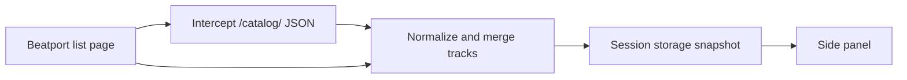

# Beatport Analyst

A Manifest V3 browser extension for producers doing market reconnaissance on [Beatport](https://www.beatport.com). Open a chart, genre page, search result, or release list and the side panel summarizes what is actually on that list: BPM, key, labels, exclusives, freshness, mix types, and more.

It is built for reading a market, not for crate digging or harmonic mixing.

## What it does

- **Reads the current Beatport list** from the page Beatport already loaded (catalog JSON, Next.js data, or DOM fallback).
- **Market brief** — exclusive and hype share, tracks published in the last 7 / 30 days, BPM median and IQR, key concentration, top labels and artists, mix-type and length bands.
- **Drill-down charts** — BPM histogram, Camelot or scale-key histogram, genre / label / artist breakdowns. Click a bucket to filter.
- **Track table** — search by title, mix, or artist; Exclusive / Hype chips; sortable columns; in-panel audio preview.
- **CSV export** of the currently visible (filtered) tracks.

No Beatport partner API, no account, no backend. Track data stays in the browser.

## How to use

1. Install the extension (see below).
2. Open a Beatport track list — Top 100, genre chart, search results, a label page, a release, and similar list views.
3. Click the **Beatport Analyst** toolbar icon. The side panel opens and the Beatport tab reloads once so the content script can intercept catalog responses.
4. Use the brief and charts to filter, play previews from the table, then **Export CSV** if you want a copy of the visible rows.

Refresh is manual after that: press **Refresh** when the list on Beatport has changed and you want a new snapshot.

If the page is not a track list, or Beatport changed their markup, the panel shows a short help card with a contact address.

## Install from source

Requires [Node.js](https://nodejs.org/) and [pnpm](https://pnpm.io/) 11.

```bash
pnpm install
```

### Development

```bash
pnpm dev           # Edge, with hot reload
pnpm dev:chrome    # Chrome
pnpm dev:firefox   # Firefox (MV3)
```

WXT will launch the browser with the extension loaded. Open Beatport, then the toolbar icon.

### Production build

```bash
pnpm build          # Edge
pnpm build:chrome
pnpm build:firefox
pnpm zip            # packaged zip for Edge; also zip:chrome / zip:firefox
```

Load the unpacked output from `.output/` (for example `.output/chrome-mv3` or `.output/edge-mv3`) via the browser’s extension page:

- Chrome: `chrome://extensions` → Developer mode → Load unpacked
- Edge: `edge://extensions` → Developer mode → Load unpacked
- Firefox: `about:debugging` → This Firefox → Load Temporary Add-on → pick the built `manifest.json`

## How it works



| Piece | Role |
| --- | --- |
| `entrypoints/beatport-fetch.ts` | Page-world script. Hooks `fetch` / XHR for same-origin `/catalog/` responses and SPA navigations. |
| `entrypoints/beatport.content.ts` | Content script. Turns catalog payloads, `__NEXT_DATA__`, and the DOM into a track snapshot and messages the background. |
| `entrypoints/background.ts` | Service worker. Persists the live snapshot, badge count, and reload-on-refresh. |
| `src/sidepanel/` | React side panel: brief, charts, filters, table, preview, CSV. |

Live extraction lives in **session** storage so closing the browser does not leave yesterday’s chart as “today.” Key notation preference is stored locally.

The extension only follows lists **you opened**. It does not crawl other charts or call `api.beatport.com`.

## Project layout

```
entrypoints/          # WXT entry: background, content script, fetch hook, side panel HTML
src/
  lib/analysis/       # BPM / Camelot stats, filters, Camelot conversion
  lib/extract/        # Catalog JSON, Next.js data, DOM parsers, merge
  lib/export/         # CSV
  lib/messaging/      # Protocol + storage keys
  lib/player/         # Preview URLs
  sidepanel/          # React UI, hooks, charts
assets/
```

## Scripts

| Command | |
| --- | --- |
| `pnpm test` | Vitest (parsers, stats, filters, CSV) |
| `pnpm build` / `pnpm build:chrome` / `pnpm build:firefox` | Production MV3 build |
| `pnpm zip` / `pnpm zip:chrome` / `pnpm zip:firefox` | Packaged zip named `beatport-analyst` |

## Permissions

- `storage` — live snapshot and UI preferences
- `sidePanel` — Chromium side panel (Firefox uses the sidebar)
- Host: `*://*.beatport.com/*` — content script and catalog intercept on Beatport only

Nothing is sent off-device. Previews play Beatport’s own sample URLs in the side panel.

## Stack

[WXT](https://wxt.dev) (Manifest V3), React 19, TypeScript, Vitest. Targets Chrome 116+, Edge, and Firefox 128+.

## License

ISC
